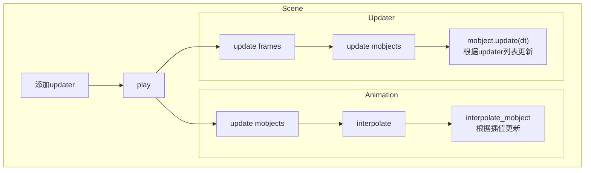

# 第 2 章 基本使用

## updater 是什么

请不要尝试用“更新器”来理解这个工具，毕竟用这种方式来理解并不方便。而又有群友提出了这样一种见解：

> [!quote] 来自 manim kindergarten 群友
> updater 可以看作是一种以==副作用==驱动的策略或手段。

## updater 怎么用

其实在一些情况下我是非常认同这一观点的，因为我们常用的 updater 方法大多都是以副作用驱使的。在这里我们给一个例子，读者不妨实际操作一下。

```python
class BasicExample(Scene):
    def construct(self):
        # 创建物件
        dot = Dot(LEFT*2)
        text = Text("This is a dot").next_to(dot, RIGHT)
        # 添加更新，使得文本保持在点的右边
        text.add_updater(lambda m: m.next_to(dot, RIGHT))
        # 将点和物件添加到场景中
        self.add(dot, text)
        # 让点绕原点旋转一周
        self.play(Rotate(dot, PI * 2, about_point=ORIGIN), 
                  run_time=4.44)
```

在这一个例子中，updater 很明显就是一种==副作用驱动==的例子。在动画中，我们只编写了点的旋转，但是文本的位置也随着点的运动而一起运动，这在感觉上就是“副作用”。

## 实际上它是如何工作的

还记得上一节提到的 `update_mobject` 方法吗，Scene 的 `play` 方法每一帧都会遍历添加到场景中的物件，并且计算出这一帧它应该更新到哪一个状态。前面的“副作用”的错觉，其实相当于是动画引擎在静默的帮你处理所有隐含的动画和更新。应此我认为“副作用”这一说法也没有任何错。

这是这样大多数情况下，当有物件添加了 updater ，那么整个执行的流程大致就是如下的样子：



## 更多的例子

> [!caution] 注意
> 2022-07-01 版本的 manimgl 在使用 updater 组合上 become 会失效，具体原因未知

这一部分其实我想作为一个练习，让读者自己实现。在实现之后，再来看看编者是如何实现的。

##### 1. 绘制一条线段 $AB$，并绘制它的垂直平分线，使得当线段 $AB$ 移动、旋转的时候，中垂线始终能够垂直平分这条线段。

> [!example] 解答
> 
> ```python
> class PerpendicularBisectorExample(Scene):
>     def construct(self):
>         # 直线
>         line = Line(LEFT*2, RIGHT*2)
>         # 中垂线
>         bisector = line.copy().rotate(PI / 2).scale(5)
>         bisector.set_color(RED)
>         self.add(line, bisector)
> 
>         bisector.add_updater(
>             lambda m: m
>                 # 设置角度
>                 .set_angle(line.get_angle() + PI / 2)
>                 # 移动到线段的中点
>                 .move_to(line.get_center())
>         )
> 
>         # 变换直线
>         self.play(line.animate.put_start_and_end_on(
>             np.array([0, 1, 0]), np.array([4, 2, 0])
>         ))
>         # 旋转直线
>         self.play(Rotate(line, PI / 2))
> 
> ```
> 
> ![[public/updater/PerpendicularBisectorExample.mp4]]
> 


##### 2. 绘制一段圆弧，使用两个 `ValueTracker` 分别控制它的弧度和半径。

> 这个样例暂时没有办法写，在先前版本是可以实现的

> [!example] 解答
> ```python
> class ArcExample(Scene):
>     def construct(self):
>         arc = Arc(angle=PI / 2, radius=2)
>         arc.set_color(YELLOW)
>         self.add(arc)
> 
>         radius = ValueTracker(2)
>         angle = ValueTracker(PI / 2)
>         arc.add_updater(lambda m: m.become(
>             Arc(angle=angle.get_value(), radius=radius.get_value())
>         ))
>         self.add(radius, angle)
> 
>         self.play(radius.animate.set_value(3))
>         self.play(angle.animate.set_value(PI))
> ```


##### 3. 绘制一条数轴，在上面添加一个点，使用 `ValueTracker` 类来控制点的位置，同时使用 `DecimalNumber` 来显示点所代表的数值。

> [!example] 解答
> 
> ```python
> class NumberLineScene(Scene):
>     def construct(self):
>         # 创建数轴
>         number_line = NumberLine(x_range=[-5, 5, 1], width=10)
>         number_line.add_numbers()
>         self.add(number_line)
> 
>         v = ValueTracker(0)
>         # 点
>         dot = Dot(number_line.n2p(v.get_value()), color=YELLOW)
>         # 显示数值
>         label = DecimalNumber(v.get_value(), num_decimal_places=2)
>         self.add(dot, label)
> 
>         dot.add_updater(
>             lambda m: m.move_to(
>                 number_line.n2p(v.get_value()) # 数轴上数值对映的实际坐标
>             )
>         )
>         label.add_updater(
>             lambda m: m
>                 .set_value(v.get_value())  # 设置数值
>                 .next_to(dot, UP)          # 设置位置
>         )
> 
>         self.play(v.animate.set_value(5), run_time=2)
>         self.play(v.animate.set_value(-4), run_time=3)
> ```
> 
> ![[public/updater/NumberLineScene.mp4]]
> 

##### 4. 在坐标系上绘制一条函数 $y=\sin(x+\varphi)$，使用你觉得方便的方法，使得改变 $\varphi$ 值的时候，图像也能动态改变。


> [!example] 解答
> 
> ```python
> class SineGraphScene(Scene):
>     def construct(self):
>         # 坐标轴
>         axes = Axes(x_range=[-10, 10, 1], y_range=[-2, 2, 0.25])
>         self.add(axes)
>         
>         # 图像
>         graph = axes.get_graph(
>             lambda x: np.sin(x), x_range=[-9, 9, 0.1]
>         )
>         self.add(graph)
> 
>         # phi 的值
>         phi = ValueTracker(0)
>         
>         # 给 grahp 添加绑定
>         graph.add_updater(
>             lambda g: g.set_points(
>                 axes.get_graph(
>                     lambda x: np.sin(x + phi.get_value()),
>                     x_range=[-9, 9, 0.1]
>                 ).get_points()
>             )
>         )
> 
>         '''
>         # 在编写该文档的时候 updater 和 become 一起用的方法坏掉了
>         # 因此只能用 `set_points` 来暂时顶替一下
>         # 如果什么时候修好了可以直接 become 一个新的 graph
>         graph.add_updater(lambda g: g.become(
>             axes.get_graph(
>                 lambda x: np.sin(x + phi.get_value()), 
>                 x_range=[-9, 9, 0.1]
>             )
>         ))
>         '''
> 
>         self.add(phi, graph)
>         self.play(phi.animate.set_value(4), run_time=3)
> ```
> 
> ![[public/updater/SineGraphScene.mp4]]
> 
> 

