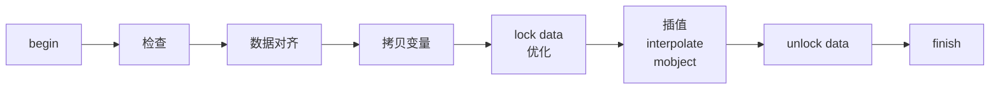

🚧🚧🚧🚧🚧🚧🚧🚧 **WIP** 🚧🚧🚧🚧🚧🚧🚧🚧

# 第 4 节 Alpha 在动画中的作用

## 碎碎念

如果是看过我 B 站视频的同学，应该会发现我把这部分顺序稍微调整了一下，但其实也无伤大雅，毕竟一旦想学会使用 updater ，那么就必然需要阅读源码，而这部分文档实际上就是带领读者去阅读 manim 源码，了解动画的工作原理。

前面我们也常常提到一个词叫做==插值==，而我们一般将它的泛型定义成这样

```python
def interpolate(start: T, end: T, alpha: float) -> T:
    return (1. - alpha) * start + alpha * end
```

但是我们前面也没有去提到关于 alpha 的内容，这一节将会尝试讲解这一困惑。

## Alpha 的含义

可能我们在图像处理的时候听说过一个 “alpha 通道” 的概念，其实就是指透明度通道。而它的取值范围是 0%~100%，也就是 $[0,1]$。

如果我们尝试将这个值带入到上面的函数定义中，发现它返回的是 start 与 end 之间的一个==中间值==。而==补全中间值==其实就是==补间动画==的一个重要任务了，它让画面的切换变得看起来更加平滑，而不会非常生硬。

## 动画的执行流程

我们再回忆一下第 1 节的内容，Animation 类编写了很多方法，在 Scene 调用 play 的时候，会按一定的顺序和逻辑去调用 Animation 的这些方法。此时我们关注的就是其中实际的动画部分了。

```python {8-10}
def progress_through_animations(self, animations: Iterable[Animation]) -> None:
    last_t = 0
    for t in self.get_animation_time_progression(animations):
        dt = t - last_t
        last_t = t
        for animation in animations:
            animation.update_mobjects(dt)
            alpha = t / animation.run_time
            # 动画插值
            animation.interpolate(alpha)
        self.update_frame(dt)
        self.emit_frame()
```

Animation 的方法方法一层套一层，最终会到达 `interpolate_mobject` 和 `interpolate_submobject` 这两个方法身上。我们来看 manim 中最常用的方法 Transform ，它是怎么实现的：

```python {8}
    def interpolate_submobject(
        self,
        submob: Mobject,
        start: Mobject,
        target_copy: Mobject,
        alpha: float
    ):
        submob.interpolate(start, target_copy, alpha, self.path_func)
        return self
```

没错，要做的事情就只有一行！从中应该可以想象到 Transform 的实现有多么简单粗暴，只需要使得在屏幕上的物件成为==起始和目标的中间值==就可以了。

其实这么一来，许多工作就落到了 `begin` 和 `finish` 头上。它们要完成的工作，包括检查合法性、==对齐起始物件和目标物件的数据==、以及一些优化问题。

其中，第二个步骤应当是在运行进程中比较关键的步骤。不妨假设有下面这个例子：

>[!example] 给定两个任意矩阵，尝试给出这两个矩阵的 0.5 处的插值
>别看了，这里面没答案

这么听的确是强人所难，如果两个矩阵不一样大，那么根本就不可能进行插值。

在这一过程中，==数据对齐==的作用就显得相当重要了。如果我们把这两个矩阵都进行扩展，使得新的矩阵大小都能覆盖两个矩阵，接着对一些缺失的数据进行修补，那么此时一个矩阵中的每一个值都能与另一个矩阵中的相应值形成==一一映射==，这样插值动画就可以畅通无阻了。




