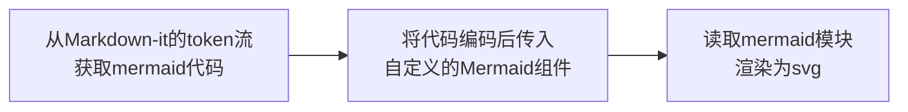

明明 Vuepress 和 Vitepress 已经足够好了，为什么我还要重新自己搞一个博客呢，真是太折腾了。但其实通过这么一路下来，总算是了解了普通的 Vue app 和 SSG 之间的区别。

## 问题发现

在新博客系统最开始，我使用的是 [vitesse-lite](https://github.com/antfy/vitesse-lite) 搭建的，其中并不包含 SSG，这也就导致了博客并不是每个页面都生成一个 html 文件，而是只有一个 `/ico vscode-icons:file-type-html;index.html`，而它的路由其实可以理解为都是脚本动态生成的。也就是说，只要刷新页面，这个页面就会失效。如果有良好的 `/ico ;_redirect` 声明，那么网页就会跳转到根路由。而没有 `/ico ;_redirect` 的网页 app，将会直接 404。如果细究其打包完成后的 `/ico vscode-icons:default-folder-opened;dist` 目录，可以发现 Vue app 中只有一个 `/ico vscode-icons:file-type-html;index.html`，静态媒体资源，以及在 `/ico vscode-icons:default-folder-opened;assets` 中的一堆 js 和 css 文件。在 [官方文档](https://cn.vuejs.org/guide/scaling-up/ssr.html#why-ssr) 中，这种 app 被称为 SPA，即客户端的单页应用。

而 SSG (Static-site Generation 静态站点生成 )，它所构建的所有网页，都可以认为是静态的，每个网页路由都有各自的文件，直接输入 url 将会直接加载对应的网页文件，而不是像上面所说的，所有路由都是动态生成。SSG 打包后，每个页面都有对应的 html 文件，每个页面都能够各自加载自己的资源和脚本，当然代价就是打包所耗费的资源多了一些。

那为什么我要从 SPA 转到 SSG 呢？单页应用不好吗？

确实没有那么方便，首当其冲的就是刷新重新渲染的问题，另外就是 giscus 评论的问题。从某个页面刷新后要重新从根页面点击进入目标页面，可想而知这是多么糟糕的用户体验。而 giscus 评论系统登录验证后，会重新跳转到原来的路由，而 SPA 的路由不复存在，需要重新生成，这也会重新路由到 404。

而使用 SSG 后，问题又蜂拥而至

> [!bug] document is not defined

这是因为打包过程中，使用的是 Nodejs，而 Nodejs 本身是没有自带 DOM 的，因此需要外部包 _jsdom_ 来为它做支撑。

> 难道问题就这么简单吗？不可能！

自己搭建博客系统，最突出的特点就是定制化，也就是说，我们想要什么功能，就可以自己加上。_mermaid-js_ 流程图是比较受欢迎的例子，想要从 Markdown 中把 `mermaid` 关键字包裹的代码块转换成待渲染的流程图，看上去很简单。



如此清晰，在 dev 阶段没有任何报错，然而在 SSG build 时却总是会发生各种各样的问题。

> [!bug] Cannot load module `/path/to/node_modules/mermaid/dist/mermaid.js`

类似的问题，在引入 giscus 模块的时候也出现了。推测其原因，还是包含两个方面：DOM，异步.

> 在这里很感谢 Vuepress Theme Hope 的作者 Mr. Hope，他的代码为解决这些问题提供了非常大的帮助，虽然在 Vue 里面不用 template，而用 `h` 函数这种操作真的很邪教 ¯\\\_(ツ)\_/¯

## 问题解决

### DOM

在 Vue 中，DOM 需要在 `nextTick` 时候才能被访问到，这其实应该算是一个基础，在 Vue 的挑战练习中应该也是能找到的。而在我本地打包 SSG 时，留意到整个打包过程其实分为两部分，一部分是 client，另一部分是 server。几乎很多这种问题都是在 server 打包时出问题的。那么我们的解决方案就很明了了：

- 方案一：在 server 打包的时候，不运行这一部分代码
- 方案二：在 server 打包的时候，使用 `try...catch` 捕捉错误，并用适当的办法处理它

#### 方案一

[Vue 官方文档](https://cn.vuejs.org/api/composition-api-lifecycle.html#onmounted) 中有这么一句话

> `onMounted` **钩子在服务器端渲染期间不会被调用。**

这样就很好办了，我们只需要在 `onMounted` 中加载需要用到 DOM 的模块就好了。Vuepress Theme Hope 也就是这么做的。

```ts
const loaded = ref(false)
onMounted(async () => {
  await import('giscus')
  loaded.value = true
})
```

这里他使用了 `onMounted` 和异步加载，我只能说：实在厉害。

#### 方案二

直接抓取错误并抛出去，或许处理不是那么合适，但至少好像成功了，也作为一种比较 **丑陋** 的方案写出来。

```ts
function renderFunction() {
  try {
    const svg = renderMermaid(props.code || '', {
      theme: props.theme || (isDark.value ? 'dark' : undefined),
      ...vm?.attrs,
    })
    return svg
  }
  catch (e) {
    if ((e as ReferenceError).message.trim() === 'document is not defined')
      return ''
    throw e
  }
}

const html = computed(() => renderFunction())
```

这样的话，在 server 渲染的时候，依然会执行这一段代码，只不过在 `renderMermaid` 这个函数报错，无法获取 DOM 的时候，自动转到 `catch` 中，返回空字符串了。这样只是避免了报错，但也能在一定程度上解决问题 ¯\\\_(ツ)\_/¯，实际应用中并不推荐这么做。

### GLSL 背景

在 pdcxs 的 [shader 教程](https://www.bilibili.com/video/BV1ce411g7B2)中，有这么一个样例，我觉得作为一个背景是非常棒的，所以我想把它引入进来。并且，有人也是专门封装了 [Vue GLSL](https://github.com/kongxiaojian123/vue-glsl) 的组件库，可以直接引用。

然而，同样是在 server 编译的时候，GLSL 的组件报错了，原因是它使用了 `window.requestAnimationFrame`，而 server 端是无 DOM 的。

然而，Vue GLSL 作为一个封装好的组件库，需要在合适的时候将组件挂载到 App 上，我们通常是在 `/ico vscode-icons:file-type-typescript-official;main.ts` 中做这件事的。我们依然使用 `onMounted` 来包裹这一引入的语句。

```ts
onMounted(async () => {
  // @ts-expect-error type declaration
  const glsl = await import('vue-glsl')
  app.use(glsl.default)
})
```

而引入和挂载这些组件似乎是异步的，我们可能并不知道什么时候它能挂载完成，因此在页面初次渲染的时候，可能组件还没注册到全局，DOM 就已经渲染了，此时我们就会看到这样的警告。

> [!warning] Failed to resolve component: gl-canvas
>
> If this is a native custom element, make sure to exclude it from component resolution via `compilerOptions.isCustomElement`.

如果加一个背景的开关，那么重新启动一下背景就能渲染出来了。但是这样显得有点麻烦捏。

这里我采取的方案是，在 `/ico vscode-icons:file-type-vue;App.vue` 中加载这一组件，加载完成后再启用背景。具体方式是这样的：

```ts
// 获取当前实例
const instance = getCurrentInstance()
// 基于 pinia 的 storage
const useGl = useGlStore()

onMounted (async () => {
  // @ts-expect-error type declaration
  const glsl = await import('vue-glsl')
  if (instance) {
    instance.appContext.app.use(glsl.default)
    useGl.isLoaded = true
  }
})
```

这样就基本上不会有错误和警告了。

