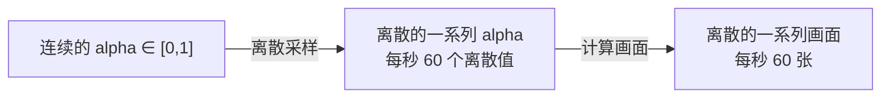
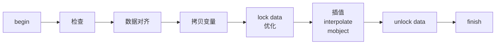

## 碎碎念

如果是看过我 B 站视频的同学，应该会发现我把这部分顺序稍微调整了一下，但其实也无伤大雅，毕竟一旦想学会使用 updater ，那么就必然需要阅读源码，而这部分文档实际上就是带领读者去阅读 manim 源码，了解动画的工作原理。

前面我们也常常提到一个词叫做==插值==，它的泛型一般定义成这样

```python
def interpolate(start: T, end: T, alpha: float) -> T:
    return (1. - alpha) * start + alpha * end
```

我们前面也没有去提到过多关于 alpha 的内容，这一节将会尝试讲解这一困惑。

## Alpha 的含义

可能我们在图像处理的时候听说过一个 “alpha 通道” 的概念，其实就是指透明度通道。而它的取值范围是 0%~100%，也就是 $[0,1]$。

如果我们尝试将这个值代入到上面的函数定义中，发现它返回的是 start 与 end 之间的一个==中间值==。而==补全中间值==其实就是==补间动画==的一个重要任务了，它让画面的切换变得看起来更加平滑，而不会非常生硬。

我们再拿出之前的一张图，在动画的过程中，alpha 的值从 0 到 1 变化，而图形也由原来的方形变得越来越像变化之后的圆形。

![[_public/updater/InterpolateExampleScene.png]]

在这里，alpha 所做的就是在 $[0,1]$ 定义域上，对于每个==选到的值==，算出对应的物件状态。

至于为什么是选到的值，这就要聊聊==视频==这一概念了。我们都知道，视频有一个叫做==帧率==的属性，它代表着每一秒钟，视频会播放多少个画面。由于计算机的算力、硬盘的存储容量均有限，我们不可能用有限的事物来存储和计算==无限的==、==连续的==现实世界，只能尽可能的去保存一些==离散的==数据，在视频播放的过程中，尝试利用人眼的视觉暂留，==骗过==人类，让我们认为这是连续的。而对于 60 帧的视频，我们只需每秒让计算机算出 60 个 alpha 值分别对应的状态，即可生成视频。



## 动画的执行流程

我们再回忆一下第 1 节的内容，Animation 类编写了很多方法，在 Scene 调用 play 的时候，会按一定的顺序和逻辑去调用 Animation 的这些方法。此时我们关注的就是其中实际的动画部分了。

```python {8-10}
def progress_through_animations(self, animations: Iterable[Animation]) -> None:
    last_t = 0
    for t in self.get_animation_time_progression(animations):
        dt = t - last_t
        last_t = t
        for animation in animations:
            animation.update_mobjects(dt)
            alpha = t / animation.run_time
            # 动画插值
            animation.interpolate(alpha)
        self.update_frame(dt)
        self.emit_frame()
```

Animation 的方法方法一层套一层，最终会到达 `interpolate_mobject` 和 `interpolate_submobject` 这两个方法身上。我们来看 manim 中最常用的方法 Transform ，它是怎么实现的：

```python {8}
    def interpolate_submobject(
        self,
        submob: Mobject,
        start: Mobject,
        target_copy: Mobject,
        alpha: float
    ):
        submob.interpolate(start, target_copy, alpha, self.path_func)
        return self
```

没错，要做的事情就只有一行！从中应该可以想象到 Transform 的实现有多么简单粗暴，只需要使得在屏幕上的物件成为==起始和目标的中间值==就可以了。

其实这么一来，许多工作就落到了 `begin` 和 `finish` 头上。它们要完成的工作，包括检查合法性、==对齐起始物件和目标物件的数据==、以及一些优化问题。

其中，第二个步骤应当是在运行进程中比较关键的步骤。不妨假设有下面这个例子：

> [!example] 给定两个任意矩阵，尝试给出这两个矩阵的 0.5 处的插值

这么听的确是强人所难，如果两个矩阵不一样大，那么根本就不可能进行插值。

在这一过程中，==数据对齐==的作用就显得相当重要了。如果我们把这两个矩阵都进行扩展，使得新的矩阵大小都能覆盖两个矩阵，接着对一些缺失的数据进行修补，那么此时一个矩阵中的每一个值都能与另一个矩阵中的相应值形成==一一映射==，这样插值动画就可以畅通无阻了。

![[_public/updater/MatrixReflect.png]]



## UpdateFromAlphaFunc

讲了那么多前置知识，终于能将这一节的重点了。这个动画类其实类似于向我们暴露了一个接口，让我们来动手实现这个动画的具体流程。

而在源码层面上，这个类继承于 Animation ，接收的参数有两个：一个是 mobject ，另一个是更新函数。而待我们实现的更新函数，就是物件更新的依据。而事实上也就是让我们直接实现 `interpolate_mobject` 方法。越是接近底层，其灵活度也就越高。

```python {9,12,13}
class UpdateFromAlphaFunc(Animation):

    def __init__(
        self,
        mobject: Mobject,
        update_function: Callable[[Mobject]],
        **kwargs
    ):
        self.update_function = update_function
        super().__init__(mobject, **kwargs)

    def interpolate_mobject(self, alpha: float) -> None:
        self.update_function(self.mobject, alpha)
```

用这一个动画类我们几乎可以实现任何效果，只需要计算出 alpha 值对应的物件状态，就可以实现我们想要的动画了。

> [!caution]
>
> 在 1.6.1 及以后的某些版本，restore 方法可能存在 bug ，导致有些效果都没有办法还原出来。

我们可以在每一帧都==恢复初态==、==重新计算当前状态==、==提交==，这样来控制其实更加方便。例如下面一个旋转平移的效果（但是笔者当前版本是 1.6.1 之后的，却没有出现问题）

![[_public/updater/ShiftRotateExample.mp4]]

```python
class ShiftRotateExample(Scene):
    def construct(self):
        square = VGroup(Square(), Dot()).shift(LEFT*5)
        numline = NumberLine(x_range=[-5, 5, 1])
        
        # 保存初态
        square.save_state()

        def anim(m: Mobject, alpha: float):
            # 恢复初态
            m.restore()
            # 移动
            m.shift(10 * alpha * RIGHT)
            # 旋转
            m.rotate(PI * 3 * alpha)

        self.add(numline, square)
        self.play(UpdateFromAlphaFunc(square, anim), run_time=4)
```

既然这样稍微复杂一些的动画效果可以用 UpdateFromAlphaFunc 实现，那么我们就用它来实现一个 MyRotate 吧！

> [!example] 尝试编写一个函数，当传入 UpdateFromAlphaFunc 时，能达到旋转的效果
> ```python
> class MyRotateExample(Scene):
>     def construct(self):
>         square = Square()
>         # 保存初态
>         square.save_state()
> 
>         def my_rotate(m: Mobject, alpha: float):
>             # 恢复初态
>             m.restore()
>             # 旋转
>             m.rotate(PI * 3 * alpha)
> 
>         self.add(square)
>         self.play(UpdateFromAlphaFunc(square, my_rotate), run_time=4)
> ```

## Alpha 还能在哪里找到——Bézier Curve

如果阅读过笔者以前的博客，应该都知道 manim 中一切皆为 Mobject ，而它又有一个重要的子类 ==VMobject== ，它的本质是==贝塞尔曲线==。而提到贝塞尔曲线，就不得不提到其生成原理：==插值==。

manim 的作者考虑的很周全，为了避免计算高阶贝塞尔曲线，提高运算性能，他使用许多段短曲线拼接成完整的复杂曲线。尽管在宏观上好像抛弃了 $n$ 阶贝塞尔曲线完整定义，“似乎”没有办法去利用它这个 alpha 了，但是 VMobject 依然实现了一个曲线采样方法：`point_from_proportion`，简写为 `pfp` 。

这个方法应该常用于函数曲线，向其中传入一个百分比 alpha ，范围是 $[0, 1]$；输出值是一个点的坐标，而这个点位置在曲线长度百分比 alpha 处。（~~一直感觉没有办法很好地表述这段话~~）

> [!example] 绘制一条曲线，并在上面取一个点，让点从曲线的起始位置，顺着曲线移动到结束位置。
> ```python
> class MoveAlongPathExample(Scene):
>     def construct(self):
>         graph = FunctionGraph(lambda x: np.sin(PI * x), 
>                               x_range=[-5, 5, 0.1])
>         self.add(graph)
> 
>         dot = Dot().move_to(graph.get_start())
>         self.add(dot)
> 
>         def update_dot(dot: Mobject, alpha: float):
>             dot.move_to(graph.pfp(alpha))
> 
>         self.play(UpdateFromAlphaFunc(dot, update_dot), run_time=4)
> ```
> 
> 然而，Grant 早就已经封装好一个动画类了，叫 MoveAlongPath ，感兴趣的读者可以尝试一下。

接下来加大一点难度。

> [!example] 绘制一条曲线，在上面取一个点，在这个点处绘制一个小箭头，使得这个箭头顺着曲线移动的时候，朝向永远顺着曲线的切线方向。小箭头可以使用 ArrowTip 代替 Dot 。
> ```python
> # 计算输入 alpha 对应点处切线的倾斜角
> def angle_of_tan(graph: ParametricCurve, alpha: float, dx=0.01) -> float:
>     vect = graph.pfp(alpha + dx) - graph.pfp(alpha - dx)
>     return angle_of_vector(vect)
> 
> class MoveAlongPathExample2(Scene):
>     def construct(self):
>         graph = FunctionGraph(lambda x: x * np.cos(PI * x) / 2,
>                               x_range=[-5, 5, 0.1])
>         arrow = ArrowTip().scale(0.8)
>         # 保存 arrow 的旋转角度
>         arrow.save_state()
>         self.add(graph, arrow)
> 
>         def update_arrow(m: Mobject, alpha: float):
>             # 恢复到初态，主要是为了恢复旋转角
>             m.restore()
>             # 旋转
>             m.rotate(angle_of_tan(graph, alpha))
>             # 移动
>             m.move_to(graph.pfp(alpha))
> 
>         self.play(UpdateFromAlphaFunc(arrow, update_arrow), run_time=6)
> ```

## UpdateFromFunc

从这个类的名字来看，其实就是无需传入 alpha 的动画更新。但是没有了 alpha ，也就无法构成动画，因此这个方法常常作为==伴随动画==，用作某一段时间内动画的附加效果。

例如，我们想让点移动的时候，文本保持在它的旁边，但是我们不使用 add_updater 方法，此时就可以使用 UpdateFromFunc 作为一个伴随效果，添加到 play 中。

```python {3}
self.play(
    dot.animate.shift(RIGHT * 2),
    UpdateFromFunc(text, lambda m: m.next_to(dot))
)
```

由于这个方法无法使用 alpha 参数，因此限制也是非常多，基本上也就只能作为伴随动画了。

## 更多的例子

##### 1. 2022-07-01 版本中， manimgl 自带样例中 CoordinateSystemExample 因为使用 always_redraw 坏掉了，究其原因是 updater 和 become 的冲突问题。现在请你尝试抛弃前面的方法，用 UpdateFromFunc 和 become 来修复它。

> [!example] 参考解答
> ```python
> # 重绘坐标线
> def redraw_h_line(m: Mobject):
>     m.become(axes.get_h_line(dot.get_left()))
> 
> def redraw_v_line(m: Mobject):
>     m.become(axes.get_v_line(dot.get_bottom()))
> 
> self.play(
>     ShowCreation(h_line),
>     ShowCreation(v_line),
> )
> self.play(
>     dot.animate.move_to(axes.c2p(3, -2)),
>     # UpdateFromFunc 作为伴随动画，下同
>     UpdateFromFunc(h_line, redraw_h_line),
>     UpdateFromFunc(v_line, redraw_v_line)
> )
> self.wait()
> self.play(
>     dot.animate.move_to(axes.c2p(1, 1)),
>     UpdateFromFunc(h_line, redraw_h_line),
>     UpdateFromFunc(v_line, redraw_v_line)
> )
> self.wait()
> 
> f_always(dot.move_to, lambda: axes.c2p(1, 1))
> self.play(
>     axes.animate.scale(0.75).to_corner(UL),
>     UpdateFromFunc(h_line, redraw_h_line),
>     UpdateFromFunc(v_line, redraw_v_line),
>     run_time=2,
> )
> ```
> 
> 这么写下来发现真的好烦， updater + become 真的是万能，但是有 bug

##### 2. 编写一个半径为 1 的圆在半径为 2 的圆上滚动一周的动画，并使用 TracedPath 来绘制起始两圆切点在动画中的轨迹。为了更清楚地看出圆的旋转角度，可以添加一个由圆心指向初始切点的箭头。

> 如果使用 UpdateFromAlphaFunc ，那么旋转的角度、半径需要手动计算后写入。

![[_public/updater/RollingCircleExample.mp4]]

> [!example] 参考解答
> ```python
> class RollingCircleExample(Scene):
>     def construct(self):
>         c1 = Circle(radius=2)
>         c2 = VGroup(
>             Circle(radius=1),   # 圆
>             Dot(),              # 圆心
>             Vector(DOWN * 0.8), # 箭头
>         )
>         c2.shift(UP * 3).set_color(GOLD)
>         c2.save_state()
> 
>         path = TracedPath(lambda: c2[0].pfp(0.75), # 圆的 3/4 处坐标
>                           stroke_width=6,
>                           stroke_color=YELLOW)
> 
>         self.add(c1, c2, path)
> 
>         def update_c2(m: Mobject, alpha: float):
>             m.restore()
>             m.rotate(-3 * TAU * alpha)
>             m.move_to(3 * np.array([
>                 np.sin(TAU * alpha),
>                 np.cos(TAU * alpha),
>                 0
>             ]))
> 
>         self.play(
>             UpdateFromAlphaFunc(c2, update_c2),
>             run_time=6
>         )
> ```

##### 3. 给定三个锚点，用贝塞尔曲线的定义来绘制这三个点生成的曲线。

![[_public/updater/BezierExample.mp4]]

> [!example] 参考解答
> ```python
> class BezierExample(Scene):
>     def construct(self):
>         points = np.array([
>             [-4, -3, 0],
>             [0, 3, 0],
>             [6, -2, 0]
>         ])
> 
>         dots = VGroup(*[Dot(p) for p in points])
>         lines = VGroup(
>             Line(points[0], points[1]),
>             Line(points[1], points[2]),
>         ).set_stroke(width=2)
> 
>         self.add(dots, lines)
> 
>         moving_dot1 = Dot(points[0], color=GOLD)
>         moving_dot2 = Dot(points[1], color=GOLD)
> 
>         moving_line = Line(points[0], points[1], color=GOLD)
> 
>         moving_line.add_updater(
>             lambda l: l.put_start_and_end_on(
>                 moving_dot1.get_center(), 
>                 moving_dot2.get_center()
>             )
>         )
> 
>         moving_dot3 = Dot(color=RED)
> 
>         path = TracedPath(moving_dot3.get_center, stroke_width=6, stroke_color=RED)
> 
>         self.add(moving_dot1, moving_dot2, moving_dot3, moving_line, path)
> 
>         self.play(
>             UpdateFromAlphaFunc(moving_dot1, lambda d, a: d.move_to(lines[0].pfp(a))),
>             UpdateFromAlphaFunc(moving_dot2, lambda d, a: d.move_to(lines[1].pfp(a))),
>             UpdateFromAlphaFunc(moving_dot3, lambda d, a: d.move_to(moving_line.pfp(a))),
>             run_time=4
>         )
> ```


