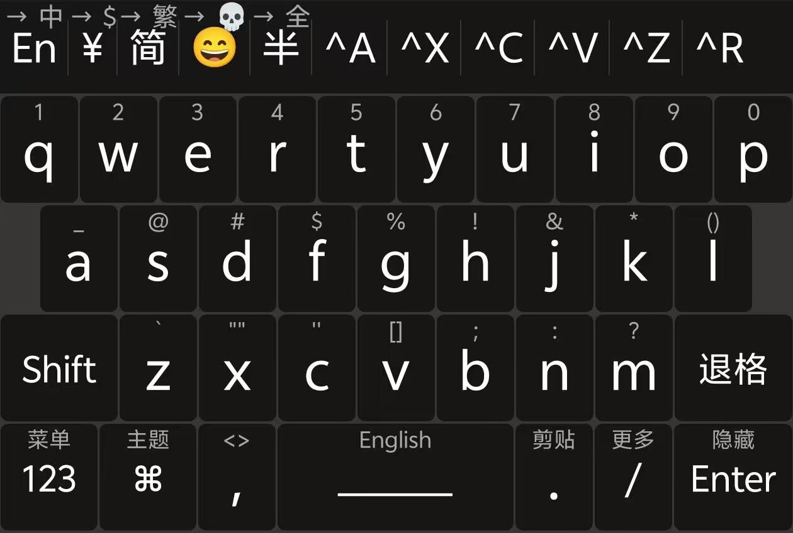

## Rime 输入法生态

- Windows 小狼毫输入法，使用 `/ico vscode-icons:file-type-light-yaml;weasel.yaml` 作为配置文件
- macOS 鼠须管输入法，使用 `/ico vscode-icons:file-type-light-yaml;squirrel.yaml` 作为配置文件
- 安卓端 Trime 同文输入法，使用 `/ico vscode-icons:file-type-light-yaml;trime.yaml` 或 `/ico vscode-icons:file-type-light-yaml;tongwenfeng.trime.yaml` 作为配置文件，分别对应“默认”和“同文风”

> 我没有 iOS 的设备，因此这部分我就没写，按理来说照着官方文档来就好了。

## 安装

首先在 https://github.com/osfans/trime 下载最新版的 Trime 安装包，大多数应该都是选择 arm64 版本。

安装后，是不会自带输入法方案的，因此我们需要手动导入输入方案，而后才能正常启动输入法。我的解决方案是：在 Windows 的“程序文件夹”中，将 data 目录下的方案全部都拷贝进手机 `/ico vscode-icons:folder-type-android;/sdcard/rime`，然后点击部署即可。

然而，自带的输入法方案总不能满足我们的需求，我觉得最满意的输入法方案是[雾凇拼音](https://github.com/iDvel/rime-ice)。其使用方案，也就是跟电脑端基本一致，将方案拷贝到本地即可，即放到 `/ico vscode-icons:folder-type-android;/sdcard/rime` 中。

## Rime 系列输入法自定义配置使用规则

在我所接触到的配置中，Windows 默认的配置存储在程序文件夹，而其他操作系统的默认配置存储在了用户文件夹。

更改配置时，我们都需要在==用户文件夹==进行修改。自定义的配置文件名称通常为 `x.custom.yaml` 的格式，即上述 `yaml` 文件的前面添加 `.custom` 中缀。对于输入法方案、配置文件，我们尽可能不改动原始的配置，而采用 custom patch 的方式。

例如，我们要为小狼毫输入法更改皮肤，则在用户文件夹的 `/ico vscode-icons:file-type-light-yaml;weasel.custom.yaml` 文件中做以下修改

```yaml title="weasel.custom.yaml"
patch:
  style:
    color_scheme: steam
    font_point: 12
```

对于雾凇拼音，我们想要使用 `uv` 前缀来做拆字查询，则做以下修改

```yaml title="rime_ice.custom.yaml"
patch:
  radical_lookup:
    prefix: "uv"
```

我们需要设置每页的候选词数目为 7 个，且使用“雾凇拼音”、“五笔 86”作为输入法方案，则做以下修改

```yaml title="default.custom.yaml"
patch:
  schema_list:
    - schema: rime_ice
    - schema: wubi86
  menu:
    page_size: 7
```

## 同文风皮肤修改

在默认配置下，同文风的皮肤更好看，但是 26 键真的很难把所有的数字和符号都塞进去。于是我考虑将顶部切换中英文、符号全角半角的后面空间，塞上全选、复制、粘贴的工具栏。但这个 bar 是属于输入方案的，所以需要在输入方案中来修改。这部分感谢 Fran 佬做的解答。

```yaml title="rime_ice.custom.yaml" ins={5-12}
switches:
  - name: ascii_mode
    states: [ 中, En ]
  # ...
  - options: [ _key_select_all ]
    states: [ ^A ]
  - options: [ _key_cut ]
    states: [ ^X ]
  - options: [ _key_copy ]
    states: [ ^C ]
  - options: [ _key_paste ]
    states: [ ^V ]
```



## 按键映射修改

需要在 `/ico vscode-icons:file-type-light-yaml;tongwenfeng.trime.yaml` 中进行查看。我比较喜欢长按 Enter 键时，隐藏输入法面板，于是需要在首选的键盘中，搜索 Enter 键的配置，做出一些修改。

```yaml title="tongwenfeng.trime.yaml" ins=/long_click: Hide/
preset_keyboards:
  default:
    author: 暖暖
    keys:
      - {click: Return, swipe_up: Escape, long_click: Hide}
```

上面的意义为，当上滑 Enter 键时，能触发按下 Esc 键，长按 Enter 键时，能触发隐藏输入法面板。

其他的部分，长按按键触发的全选复制粘贴，就可以替换成我们更常用的按键了。

## 英文单词排序太靠前的问题

雾凇拼音支持使用中英文混合输入，但是用户常常发现 “buy”, “yes”, “went”, “bus” 太靠前。通过其 issue `#671` 我们了解到，可以使用下面的配置来优化这一点

```yaml title="rime_ice.custom.yaml"
patch:
  reduce_english_filter:
    mode: all
    idx: 4  # 英文单词从第 4 个开始提示
```

## 个人配置总览

以下为我个人使用比较舒服的配置，可供参考

> [!example] default.custom.yaml
> ```yaml
> patch:
>   # 方案列表
>   schema_list:
>     - schema: rime_ice
>     - schema: wubi86
>     - schema: japanese
> 
>   # 候选词个数
>   menu/page_size: 7
> 
>   # 方案选单相关
>   switcher:
>     caption: 「方案选单」
>     hotkeys:
>       - F4
>       - Control+Shift+grave
>     save_options:
>       - full_shape
>       - ascii_punct
>       - traditionalization
>       - emoji
>       - search_single_char
>     fold_options: true
>     abbreviate_options: true
>     option_list_separator: ' / '
> 
>   # 按键行为
>   ascii_composer/good_old_caps_lock: true  # true | false
>   ascii_composer/switch_key:
>     Caps_Lock: commit_code
>     Control_L: noop
>     Control_R: noop
>     # 按下左 shift 英文字符直接上屏，不需要再次回车，输入法保持英文状态
>     Shift_L: commit_code
>     Shift_R: commit_code
> 
>   # 以词定字（上屏当前词组的第一个或最后一个字）
>   key_binder/select_first_character: 
>   key_binder/select_last_character: "grave"
>   # 快捷键
>   key_binder/bindings:
>     # emacs_editing:
>     - { when: composing, accept: Control+p, send: Up }
>     - { when: composing, accept: Control+n, send: Down }
>     - { when: composing, accept: Control+b, send: Left }
>     - { when: composing, accept: Control+f, send: Right }
>     - { when: composing, accept: Control+a, send: Home } # 光标跳转至行首
>     - { when: composing, accept: Control+e, send: End }  # 光标跳转至行尾
>     - { when: composing, accept: Control+d, send: Delete }
>     - { when: composing, accept: Control+k, send: Shift+Delete }
>     # move_by_word_with_tab: Tab/Shift+Tab 切换光标至下/上一个拼音
>     - { when: composing, accept: ISO_Left_Tab, send: Shift+Left }
>     - { when: composing, accept: Shift+Tab, send: Shift+Left }
>     - { when: composing, accept: Tab, send: Shift+Right }
>     # paging_with_minus_equal: 翻页：- =
>     - { when: has_menu, accept: minus, send: Page_Up }
>     - { when: has_menu, accept: equal, send: Page_Down }
> 
>   punctuator:
>     full_shape:
>       ' ' : { commit: '　' }
>       ',' : { commit: ， }
>       '.' : { commit: 。 }
>       '<' : [ 《, 〈, «, ‹ ]
>       '>' : [ 》, 〉, », › ]
>       '/' : [ ／, ÷ ]
>       '?' : { commit: ？ }
>       ';' : { commit: ； }
>       ':' : { commit: ： }
>       '''' : { pair: [ '‘', '’' ] }
>       '"' : { pair: [ '“', '”' ] }
>       '\' : [ 、, ＼ ]
>       '|' : [ ·, ｜, '§', '¦' ]
>       '`' : ｀
>       '~' : ～
>       '!' : { commit: ！ }
>       '@' : [ ＠, ☯ ]
>       '#' : [ ＃, ⌘ ]
>       '%' : [ ％, '°', '℃' ]
>       '$' : [ ￥, '$', '€', '£', '¥', '¢', '¤', ₩ ]
>       '^' : { commit: …… }
>       '&' : ＆
>       '*' : [ ＊, ·, ・, ×, ※, ❂ ]
>       '(' : （
>       ')' : ）
>       '-' : －
>       '_' : ——
>       '+' : ＋
>       '=' : [ ＝, 々, 〃 ]
>       '[' : [ 「, 【, 〔, ［, 〚, 〘 ]
>       ']' : [ 」, 】, 〕, ］, 〛, 〙 ]
>       '{' : [ 『, 〖, ｛ ]
>       '}' : [ 』, 〗, ｝ ]
>     half_shape:
>       ',' : { commit: ， }
>       '.' : { commit: 。 }
>       '<' : [ 《, 〈, «, ‹, ˂, ˱ ]
>       '>' : [ 》, 〉, », ›, ˃, ˲ ]
>       '/' : '/'
>       '?' : { commit: ？ }
>       ';' : { commit: ； }
>       ':' : { commit: ： }
>       '''' : { pair: [ '‘', '’' ] }
>       '"' : { pair: [ '“', '”' ] }
>       '\' : '、'
>       '|' : '|'
>       '`' : ['·', '`']
>       '~' : ['～', '~']
>       '!' : { commit: ！ }
>       '@' : [ '@', ©, ®, ℗ ]
>       '#' : '#'
>       '%' : '%'
>       '$' : '$'
>       '^' : { commit: …… }
>       '&' : '&'
>       '*' : '*'
>       '(' : （
>       ')' : ）
>       '-' : '-'
>       '_' : ——
>       '+' : '+'
>       '=' : '='
>       '[' : [ 「, 【, 〔, ［, 〚, 〘 ]
>       ']' : [ 」, 】, 〕, ］, 〛, 〙 ]
>       '{' : [ 『, 〖, ｛ ]
>       '}' : [ 』, 〗, ｝ ]
> ```

> [!example] weasel.custom.yaml
> ```yaml
> patch:
>   "app_options/org.microsoft.VSCode":
>     ascii_mode: true
>   style:
>     color_scheme: psionics
>     comment_font_point: 12
>     font_face: "Microsoft YaHei UI"
>     font_point: 12
>     inline_preedit: true
>     label_font_point: 12
>     layout:
>       border_width: 0
>       candicate_spacing: 4
>       corner_radius: 6
>       hilite_padding: 6
>       hilite_spacing: 4
>       margin_x: 6
>       margin_y: 6
>       min_width: 160
>       spacing: 10
> ```

> [!example] squirrel.custom.yaml
> ```yaml
> patch:
>   style:
>     color_scheme: psionics
>     font_face: 'Songti SC Bold'
>     font_point: 20
>     candidate_list_layout: linear
>     text_orientation: horizontal
>     inline_preedit: true
>     comment_font_point: 14
>     label_font_point: 14
>     corner_radius: 10
>     hilited_corner_radius: 8
>     line_spacing: 6
>     translucency: true
>   "app_options/org.microsoft.VSCode": 
>     ascii_mode: true
> ```

> [!example] tongwenfeng.trime.custom.yaml
> ```yaml
> patch:
>   height:
>     1: &jpgd1 30 #表情键盘
>     2: &jpgd2 24 #颜文字键盘1
>     3: &jpgd3 24 #颜文字键盘2
>     4: &jpgd4 48 #主键盘
>     5: &jpgd5 39.5 #符号键盘
>     6: &hgap 1 #键盘横缝大小
>     7: &sgap 1 #键盘竖缝大小
> 
>   #键盘高度
>   round_corner:
>     1: &round1 12 #按键圆角半径
>     2: &round2 0 #候选窗口圆角
>     3: &round3 12 #回车键圆角
> 
>   #键盘布局
>   preset_keyboards:
>     default:
>       author: "暖暖"
>       name: 26键默认布局
>       width: 10
>       height: *jpgd4
>       ascii_mode: 0
>       keys:
>         - {click: q, long_click: 1, key_back_color: bh1, key_text_color: th1}
>         - {click: w, long_click: 2, key_back_color: bh1, key_text_color: th1}
>         - {click: e, long_click: 3, key_back_color: bh1, key_text_color: th1}
>         - {click: r, long_click: 4, key_back_color: bh1, key_text_color: th1}
>         - {click: t, long_click: 5, key_back_color: bh1, key_text_color: th1}
>         - {click: y, long_click: 6, swipe_up: '^', key_back_color: bh1, key_text_color: th1}
>         - {click: u, long_click: 7, key_back_color: bh1, key_text_color: th1}
>         - {click: i, long_click: 8, key_back_color: bh1, key_text_color: th1}
>         - {click: o, long_click: 9, key_back_color: bh1, key_text_color: th1, swipe_up: '('}
>         - {click: p, long_click: 0, key_back_color: bh1, key_text_color: th1, swipe_up: ')'}
> 
>         - {width: 5, key_back_color: bh2, key_text_color: th2}
>         - {click: a, long_click: _, key_back_color: bh2, key_text_color: th2, swipe_up: '+'}
>         - {click: s, long_click: '@', key_back_color: bh2, key_text_color: th2, swipe_up: '-'}
>         - {click: d, long_click: '#', key_back_color: bh2, key_text_color: th2}
>         - {click: f, long_click: '$', key_back_color: bh2, key_text_color: th2}
>         - {click: g, long_click: '%', swipe_down: "date_time", key_back_color: bh2, key_text_color: th2}
>         - {click: h, long_click: '!', swipe_down: "+", key_back_color: bh2, key_text_color: th2}
>         - {click: j, long_click: '&', swipe_down: "-", key_back_color: bh2, key_text_color: th2}
>         - {click: k, long_click: '*', swipe_down: "_", key_back_color: bh2, key_text_color: th2}
>         - {click: l, long_click: '(){Left}', swipe_down: "=", key_back_color: bh2, key_text_color: th2}
>         - {width: 5, key_back_color: bh2, key_text_color: th2}
> 
>         - {click: Shift_L, composing: delimiter, width: 15, hilited_key_back_color: benter, key_back_color: bbs, key_text_color: tbs}
>         - {click: z, long_click: '`', swipe_down: '[]{Left}', key_back_color: bh3, key_text_color: th3}
>         - {click: x, long_click: '""{Left}', swipe_down: '{}{Left}', key_back_color: bh3, key_text_color: th3}
>         - {click: c, long_click: "''{Left}", swipe_down: ' ', key_back_color: bh3, key_text_color: th3}
>         - {click: v, long_click: "[]{Left}", swipe_down: paste, key_back_color: bh3, key_text_color: th3}
>         - {click: b, long_click: ";", swipe_down: "\\", key_back_color: bh3, key_text_color: th3}
>         - {click: n, long_click: ":", key_back_color: bh3, key_text_color: th3}
>         - {click: m, long_click: '?', swipe_down: "|", key_back_color: bh3, key_text_color: th3}
>         - {click: BackSpace, width: 15, key_back_color: bbs, key_text_color: tbs}
> 
>         - {click: Keyboard_number, long_click: Menu, width: 12.5, key_back_color: bgn, key_text_color: tgn}
>         - {click: Keyboard_bqrw, long_click: Theme_settings, swipe_down: Color_switch, swipe_up: Color_switch, width: 12.5, key_text_size: "18", key_back_color: bgn, key_text_color: tgn}
>         - {click: ',', label: '，', long_click: '<>{Left}', key_back_color: bh4, key_text_color: th4}
>         - {click: space, long_click: Mode_switch, swipe_left: "Left", swipe_right: "Right", swipe_up: Schema_switchcn, width: 30, key_back_color: bkg, key_text_color: tkg}
>         - {click: '.', label: '。', long_click: liquid_keyboard_clipboard, key_back_color: bh4, key_text_color: th4}
>         - {click: '/', long_click: liquid_keyboard_switch , swipe_down: '\', key_text_size: "18", key_back_color: bh4, key_text_color: th4}
>         - {click: Return, composing: Return1, swipe_up: Escape, width: 15, long_click: Hide, key_back_color: benter, key_text_color: tenter}
> 
>     number:
>       author: "暖暖"
>       name: 数字+
>       width: 16.6
>       height: *jpgd4
>       ascii_mode: 1
>       keys:
>         - {click: '{}{Left}', long_click: '【】{Left}', key_back_color: bgn, key_text_color: tgn}
>         - {click: '+', long_click: '#', key_back_color: bgn, key_text_color: tgn}
>         - {click: 1}
>         - {click: 2}
>         - {click: 3}
>         - {click: space1, key_back_color: bgn, key_text_color: tgn}
> 
>         - {click: '_', long_click: '[]{Left}', key_back_color: bgn, key_text_color: tgn}
>         - {click: '-', long_click: '%', key_back_color: bgn, key_text_color: tgn}
>         - {click: 4}
>         - {click: 5}
>         - {click: 6}
>         - {label: EN, click: Keyboard_defaulten, key_back_color: bgn, key_text_color: tgn}
> 
>         - {click: '(){Left}', long_click: '@', key_back_color: bgn, key_text_color: tgn}
>         - {click: '*', long_click: '±', key_back_color: bgn, key_text_color: tgn}
>         - {click: 7, long_click: select_all}
>         - {click: 8, long_click: copy}
>         - {click: 9, long_click: paste_clip, swipe_down: paste}
>         - {click: BackSpace, key_back_color: bbs, key_text_color: tbs}
> 
>         - {click: Keyboard_default, long_click: ':', key_back_color: bgn, key_text_color: 'tgn'}
>         - {click: '/', long_click: '\', key_back_color: bgn, key_text_color: tgn}
>         - {click: ., long_click: Keyboard_bqrw, key_back_color: bgn, key_text_color: tgn}
>         - {click: 0, long_click: cut}
>         - {click: '=', long_click: '≠', key_back_color: bgn, key_text_color: tgn}
>         - {click: Return, long_click: Menu, key_back_color: benter, key_text_color: tenter}
> ```

> [!example] 电脑端 rime_ice.custom.yaml
> ```yaml
> patch:
>   reduce_english_filter:
>     mode: all
>     idx: 4
>   radical_lookup:
>     prefix: "uv"
>   switches:
>   - name: ascii_mode
>     states: [ 中, Ａ ]
>     reset: 1
>   - name: ascii_punct  # 中英标点
>     states: [ ¥, $ ]
>   - name: traditionalization
>     states: [ 简, 繁 ]
>   - name: emoji
>     states: [ 💀, 😄 ]
>     reset: 1
>   - name: full_shape
>     states: [ 半角, 全角 ]
>   - name: search_single_char
>     abbrev: [词, 单]
>     states: [正常, 单字]
> ```

> [!example] 手机端 rime_ice.custom.yaml
> ```yaml
> patch:
>   reduce_english_filter:
>     mode: all
>     idx: 4
>   radical_lookup:
>     prefix: "uv"
>   switches:
>   - name: ascii_mode
>     states: [ 中, Ａ ]
>   - name: ascii_punct  # 中英标点
>     states: [ ¥, $ ]
>   - name: traditionalization
>     states: [ 简, 繁 ]
>   - name: emoji
>     states: [ 💀, 😄 ]
>     reset: 1
>   - name: full_shape
>     states: [ 半, 全 ]
>   - options: [ _key_select_all ]
>     states: [ ^A ]
>   - options: [ _key_cut ]
>     states: [ ^X ]
>   - options: [ _key_copy ]
>     states: [ ^C ]
>   - options: [ _key_paste ]
>     states: [ ^V ]
>   - options: [ _key_undo ]
>     states: [ ^Z ]
>   - options: [ _key_redo ]
>     states: [ ^R ]
> ```
